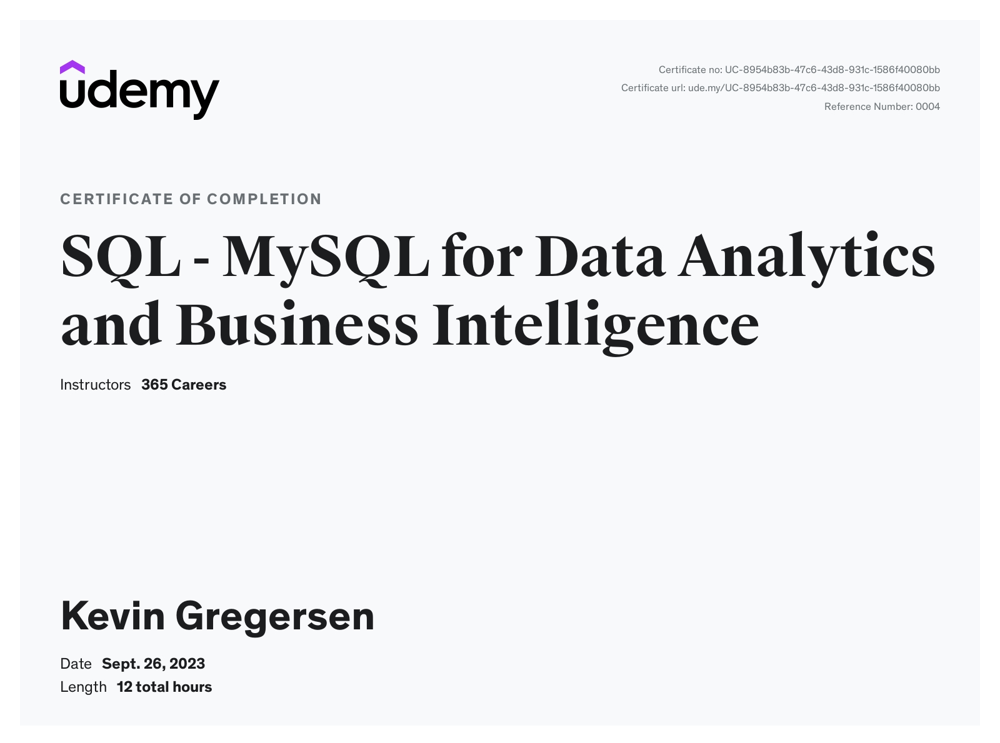

# SQL-Certificate-Coursework

<h3>MySQL for Data Analytics & Business Intelligence</h3>

<i>Topics Learned:</i>
* Aggregate functions
* Joins & Union
* CASE Statement
* Subqueries
* CTEs
* Temp Tables
* Views
* Stored Routines
* Window Functions
* Variables
* Triggers
* Indexes
* Exporting Datasets
* Combining SQL & Tableau

  

